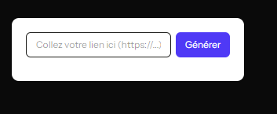
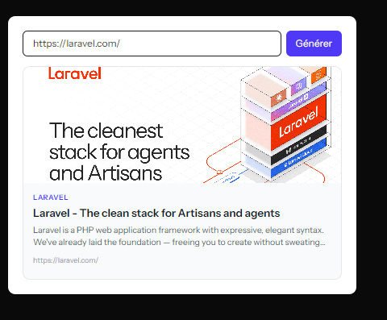

# 📌 Link Preview Component (Livewire 4 + Laravel 13)

Un composant Livewire pour générer une prévisualisation riche (titre, description, image, fournisseur) à partir d'une URL.

---

## ✅ Fonctionnalités

- **Validation** : Vérifie que l'URL est valide avant de récupérer les métadonnées.
- **Prévisualisation riche** : Affiche le titre, la description, l'image et le nom du fournisseur (ex: YouTube, Twitter).
- **Gestion des erreurs** : Affiche un message si l'URL ne peut pas être analysée.
- **Chargement asynchrone** : Utilise `wire:loading` pour désactiver le bouton et masquer la prévisualisation pendant le chargement.
- **Design réactif** : Intègre Tailwind CSS pour un rendu moderne et adaptable.

---

## 🛠 Installation

### 1. Installer Livewire 4

```bash
composer require livewire/livewire
```

Publier les assets (si nécessaire) :

```bash
php artisan livewire:publish
```

### 2. Installer la bibliothèque Embed

```bash
composer require embed/embed
```

### 3. Créer le composant Livewire

Génère le composant et sa vue :

```bash
php artisan make:livewire LinkPreview
```

---

## 📂 Structure des fichiers

```
app/
└── Livewire/
    └── LinkPreview.php       # Logique du composant

resources/
└── views/
    └── livewire/
        └── link-preview.blade.php  # Vue Blade
```

---

## 💡 Utilisation

### 1. Inclure le composant dans une vue

```blade
<livewire:link-preview />
```

### 2. Personnaliser le style

Le composant utilise Tailwind CSS. Ont peut modifier les classes dans `link-preview.blade.php` pour adapter le design au projet.

---

## 🔧 Personnalisation

### Modification des règles de validation

Dans `LinkPreview.php`, modifie la propriété `$rules` :

```php
protected $rules = [
    'url' => 'required|url|max:2048', // Exemple : limite la taille de l'URL
];
```

### Ajout de champs supplémentaires

Pour récupérer plus de métadonnées (ex: favicon, date de publication), modifiez la méthode `fetchPreview` :

```php
$this->metadata = [
    'title' => $info->title,
    'description' => $info->description,
    'image' => $info->image?->__toString(),
    'provider' => $info->providerName,
    'url' => $this->url,
    'favicon' => $info->favicon?->__toString(), // Nouveau champ
];
```

### Gestion avancée des erreurs

On peut affichés des messages d'erreur plus détaillés en utilisant `$e->getMessage()` :

```php
catch (Exception $e) {
    $this->error = "Erreur : " . $e->getMessage();
}
```

---

## 🎨 Aperçu du design

Le composant utilise les classes Tailwind suivantes pour le style :

- **Formulaire** : `max-w-xl`, `bg-white`, `rounded-xl`, `shadow-md`
- **Bouton** : `bg-indigo-600`, `hover:bg-indigo-700`
- **Carte de prévisualisation** : `border`, `rounded-xl`, `hover:shadow-lg`
- **Image** : `object-cover`, `group-hover:scale-105` (effet de zoom au survol)

---

## 🚀 Exemple de sortie

Input pour le lien : 



Resultat : 



---

## 📝 Notes

- **Performances** : La bibliothèque `embed/embed` peut être lente pour certaines URLs. Pour optimiser, envisagez un cache (ex: Redis) pour stocker les métadonnées déjà récupérées.
- **Sécurité** : Assurez-vous que les URLs fournies par les utilisateurs sont fiables (évite les requêtes vers des domaines malveillants).
- **Compatibilité** : Testé avec Laravel 13 et Livewire 4. Pour des versions antérieures, ajustez les dépendances.

---

